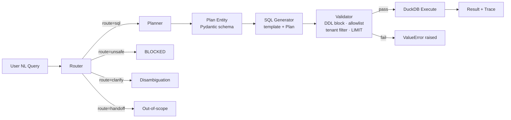

# Autoptic FDE Dossier — Area A: Deterministic Entities (PQL Proxy)

**Repo:** `retail-copilot-gcp`
**Date:** 2026-02-07
**Scope:** NL→Intent→Slots→Template→Validator deterministic query-object pipeline

---

## 1. Repo Scan Summary

| # | Artifact | Path | Dossier Signal |
|---|----------|------|----------------|
| 1 | Intent taxonomy | `catalog/intents.yaml` | Canonical intent→slot→template binding (4 intents) |
| 2 | Tenant policy config | `catalog/policies.yaml` | Allowlists, denylists, cost caps, RLS/CLS, role-based access |
| 3 | SQL policy rules | `sql/sql_policies.yaml` | Hard-block ops, complexity limits, required clauses, template validation |
| 4 | Pydantic entity models | `src/core/types.py` | `Plan`, `RouterOutput`, `Intent`, `Trace` — the deterministic entity contracts |
| 5 | Security context model | `src/core/context.py` | `SecurityContext` (frozen Pydantic) — tenancy boundary |
| 6 | SQL Validator | `src/core/validator.py` | DDL/DML block, table allowlist, tenant isolation, LIMIT enforcement |
| 7 | Router | `src/core/router.py` + `prompts/router-retail-v1.md` | NL→route classification with JSON schema constraint + `temperature=0.0` |
| 8 | Planner | `src/core/planner.py` | NL+intent→slot extraction into `Plan` Pydantic entity |
| 9 | SQL Templates | `sql/templates/*.sql` | Jinja2-parameterized, tenant-scoped, LIMIT-capped templates |
| 10 | Promotion gates | `ops/gates.yaml` | Blocker/warning/advisory enforcement tiers + canary ramp + auto-revert |
| 11 | Golden-set eval | `eval/golden_set/*.json` + `scripts/evaluate_golden_set.py` | Determinism & accuracy regression harness |
| 12 | SQL lint tests | `tests/test_sql_lints.py` | 9 policy-enforcement unit tests (DDL, tenant, budget, complexity, parameterization) |

**Best-fit dossier area:** This repo is strongest for **Area A — Deterministic Entities (PQL proxy)**. The entire codebase is a textbook NL→intent→slots→template→validator pipeline with explicit policy surfaces, Pydantic schema contracts, and multi-tenant blast-radius controls.

---

## 2. Dossier Insert — Area A

### Deterministic Entity Pattern: Retail NL-to-SQL Query Entity

**Repo artifact(s):** `README.md`, `docs/SOW_Dossier.md`, `catalog/intents.yaml`, `catalog/policies.yaml`, `sql/sql_policies.yaml`

**Location (evidence):**

| Component | File | Symbol / Search Token |
|-----------|------|-----------------------|
| Route classifier | `src/core/router.py` | `class Router`, `def route` |
| Route prompt | `prompts/router-retail-v1.md` | `"route": "qa\|sql\|unsafe\|handoff\|clarify"` |
| Slot extractor (Planner) | `src/core/planner.py` | `class Planner`, `def plan` |
| Plan entity | `src/core/types.py` | `class Plan(BaseModel)` |
| Router entity | `src/core/types.py` | `class RouterOutput(BaseModel)` |
| Security boundary | `src/core/context.py` | `class SecurityContext(BaseModel)` |
| SQL Validator | `src/core/validator.py` | `class Validator`, `def validate` |
| SQL Generator | `src/core/sql_generator.py` | `class SQLGenerator`, `def generate_sql` |
| Intent catalog | `catalog/intents.yaml` | `intent_id: "net_sales"` |
| Tenant policies | `catalog/policies.yaml` | `tenant_policies:`, `denied_operations:` |
| SQL policies | `sql/sql_policies.yaml` | `denied_operations:`, `complexity_limits:` |
| Template (time series) | `sql/templates/time_series_sales.sql` | `{{tenant_id}}`, `{{row_limit}}` |
| Template (margin) | `sql/templates/margin_by_category.sql` | `{{tenant_id}}`, `{{category_filter}}` |
| Promotion gates | `ops/gates.yaml` | `no_ddl_dml_escape: true` |
| Pipeline orchestrator | `src/ui/app.py` | `route_out = router.route(...)` (line 82) |

**Flow:**



Bullet-chain version:

1. **NL input** → `Router.route()` classifies into `{qa, sql, unsafe, handoff, clarify}` via LLM + `RouterOutput` Pydantic schema at `temperature=0.0`
2. **Intent + slot extraction** → `Planner.plan()` fills `Plan` entity (intent_id, measures, dimensions, filters, limits, viz_hint, needs_disambiguation)
3. **Template binding** → `SQLGenerator.generate_sql(plan)` converts `Plan` JSON into DuckDB SQL; Jinja2 templates (`sql/templates/`) pre-define parameterized SQL shapes
4. **Validator gate** → `Validator.validate(sql, tenant_id)` enforces DDL/DML denylist, SELECT-only, LIMIT required, table allowlist (via sqlglot AST), tenant_id WHERE clause
5. **Execute** → `DuckDBAdapter.execute_query(sql)` returns DataFrame, captured in `Trace` with latency_ms + cost_estimate_usd

---

### Policy Surface

| Policy | Kind | Enforcement | Source |
|--------|------|-------------|--------|
| DDL/DML blocked (DROP, DELETE, UPDATE, INSERT, ALTER, TRUNCATE, GRANT, REVOKE) | Forbidden | Hard — `ValueError` | `src/core/validator.py:17` |
| SELECT/WITH only | Forbidden | Hard — `ValueError` | `src/core/validator.py:23` |
| Unsafe NL queries (PII exfil, out-of-scope) | Forbidden | Hard — route="unsafe" | `prompts/router-retail-v1.md:31` |
| Banned SQL functions (EXECUTE_IMMEDIATE, EVAL, REGEXP_EXTRACT) | Forbidden | Hard | `sql/sql_policies.yaml:30-34` |
| SELECT * | Forbidden | Hard | `sql/sql_policies.yaml:127-128` |
| Table allowlist (fct_sales, dim_product, dim_store + 5 more) | Bounded | Hard — `ValueError` | `src/core/validator.py:35-38`, `sql/sql_policies.yaml:54-62` |
| PII column restriction (email, phone, ssn, credit_card) | Bounded | Hard | `sql/sql_policies.yaml:65-72` |
| LIMIT required (max 10,000) | Bounded | Hard — `ValueError` | `src/core/validator.py:27-28`, `sql/sql_policies.yaml:43-46` |
| tenant_id WHERE clause required | Bounded | Hard — `ValueError` | `src/core/validator.py:42-53` |
| Max query cost 10 GB / $100/day | Bounded | Hard + alert | `catalog/policies.yaml:57-61` |
| Max timeout 300s | Bounded | Hard | `catalog/policies.yaml:15` |
| Complexity limits (3 subqueries, 5 joins, 3 CTEs, 2 UNIONs, 10 WHERE conditions) | Bounded | Hard | `sql/sql_policies.yaml:75-80` |
| Role-based intent restriction (viewer: 2 intents, analyst: 3, admin: all) | Bounded | Soft (router) | `catalog/policies.yaml:76-88` |
| Max date range 365 days | Bounded | Soft | `catalog/policies.yaml:12` |
| Canary auto-halt (error_rate > baseline+5%, latency > baseline×1.2) | Bounded | Auto-revert | `ops/gates.yaml:145-149` |

---

### Validation Gates

| Gate | What is checked | How failures are handled |
|------|----------------|--------------------------|
| Router schema | `RouterOutput` Pydantic validates `route` in `{qa,sql,unsafe,handoff,clarify}` | JSON parse failure → fallback `route="clarify"` (`router.py:48-52`) |
| Planner schema | `Plan` Pydantic validates intent_id, measures[], dimensions[], filters[], limits.rows | JSON parse failure → `needs_disambiguation=True`, `intent_id="error"` (`planner.py:43-52`) |
| Disambiguation | `plan.needs_disambiguation` flag checked | Pipeline halts, returns clarification to user (`app.py:90-92`) |
| DDL/DML scan | Keyword scan of SQL string uppercase | `ValueError("Security Violation: Forbidden keyword...")` |
| SELECT-only | First token must be SELECT or WITH | `ValueError("Security Violation: Query must start with SELECT or WITH.")` |
| LIMIT enforcement | "LIMIT" substring check | `ValueError("Policy Violation: Query must contain a LIMIT clause.")` |
| Table allowlist | sqlglot AST `exp.Table` extraction vs `self.allowed_tables` set | `ValueError("Security Violation: Unauthorized tables: {set}")` |
| Tenant isolation | sqlglot `exp.Where` AST + regex fallback for `tenant_id = '{tenant_id}'` | `ValueError("Security Violation: Missing tenant_id filter")` |
| Promotion blocker gates | `router_deterministic`, `sql_lints_pass`, `no_ddl_dml_escape`, `tenant_isolation_enforced`, `golden_success_ratio` | Deployment blocked (`ops/gates.yaml:45-51`) |
| Golden-set regression | 90%+ router accuracy, deterministic plan output | `assert accuracy >= 0.90` (`test_router.py:115`); `assert plan1 == plan2` (`test_planner.py:178`) |

---

### (INFERENCE) Autoptic Translation

> "PQL entity design = the `Plan` Pydantic model is the deterministic query-object (PQL entity). Natural language is decomposed into a bounded, schema-validated `Plan` containing intent_id, measures, dimensions, filters, and limits — never raw SQL. A hard validator gate enforces a policy surface (DDL denylist, table allowlist, tenant isolation, complexity caps, cost budgets) before any query reaches the engine. The `RouterOutput` acts as a triage entity that gates which NL inputs even enter the query pipeline vs. being refused/disambiguated. Together, `RouterOutput` + `Plan` + `Validator` form a three-layer deterministic guardrail stack analogous to PQL's compile-time type safety + runtime policy enforcement."

---

### Key Code Snippets

#### Snippet 1 — Plan entity contract

**File:** `src/core/types.py` — `class Plan(BaseModel)` (lines 10–20)

```python
class Plan(BaseModel):
    intent_id: str
    tables: List[str]
    measures: List[Dict[str, Any]]
    dimensions: List[Dict[str, Any]]
    filters: List[Dict[str, Any]]
    limits: Dict[str, int]
    viz_hint: Optional[Dict[str, Any]] = None
    needs_disambiguation: bool = False
    clarification_question: Optional[str] = None
    reasoning: Optional[str] = None
```

#### Snippet 2 — Validator policy gate

**File:** `src/core/validator.py` — `Validator.validate()` (lines 9–38)

```python
def validate(self, sql: str, tenant_id: Optional[str] = None) -> bool:
    """
    Validates SQL against safety rules.
    Returns True if safe, raises ValueError if unsafe.
    """
    sql_upper = sql.upper()

    # 1. Block DDL/DML
    forbidden_keywords = ["DROP", "DELETE", "UPDATE", "INSERT", "ALTER", "TRUNCATE", "GRANT", "REVOKE"]
    for kw in forbidden_keywords:
        if kw in sql_upper:
            raise ValueError(f"Security Violation: Forbidden keyword '{kw}' detected.")

    # 2. Enforce SELECT only
    if not sql_upper.strip().startswith("SELECT") and not sql_upper.strip().startswith("WITH"):
         raise ValueError("Security Violation: Query must start with SELECT or WITH.")

    # 3. Enforce LIMIT (Simple check)
    if "LIMIT" not in sql_upper:
         raise ValueError("Policy Violation: Query must contain a LIMIT clause.")

    # 4. Enforce table allowlist
    from sqlglot import parse_one, exp

    try:
        parsed = parse_one(sql)
        tables = {str(t.name).lower() for t in parsed.find_all(exp.Table)}
        unauthorized = tables - {t.lower() for t in self.allowed_tables}
        if unauthorized:
            raise ValueError(f"Security Violation: Unauthorized tables: {unauthorized}")
```

#### Snippet 3 — Router deterministic classification

**File:** `src/core/router.py` — `Router.route()` (lines 14–38)

```python
def route(
    self,
    user_query: str,
    user_ctx: SecurityContext,
    glossary_hits: Optional[list] = None,
    policy_profile: Optional[Dict[str, Any]] = None
) -> RouterOutput:

    # Construct the full prompt with inputs
    inputs_section = f"""
## Actual Inputs
- user_query: "{user_query}"
- user_ctx: {user_ctx.model_dump_json()}
- glossary_hits: {json.dumps(glossary_hits or [])}
- policy_profile: {json.dumps(policy_profile or {})}
"""
    full_prompt = self.prompt_template + "\n" + inputs_section

    # Call LLM
    response_text = self.llm.generate_content(
        prompt=full_prompt,
        temperature=0.0,
        response_schema=RouterOutput.model_json_schema()
    )
```

---

## 3. Evidence Ledger Rows

| # | Claim | Evidence Type | File | Symbol / Line | Search Token |
|---|-------|---------------|------|---------------|--------------|
| 1 | NL→route classification with 5-way enum | EVIDENCE | `src/core/types.py:22-25` | `class RouterOutput(BaseModel)` | `Literal["qa", "sql", "unsafe", "handoff", "clarify"]` |
| 2 | Router forces `temperature=0.0` for determinism | EVIDENCE | `src/core/router.py:36` | `Router.route()` | `temperature=0.0` |
| 3 | Router uses Pydantic JSON schema as LLM response constraint | EVIDENCE | `src/core/router.py:37` | `Router.route()` | `response_schema=RouterOutput.model_json_schema()` |
| 4 | Plan entity is Pydantic-validated deterministic query object | EVIDENCE | `src/core/types.py:10-20` | `class Plan(BaseModel)` | `intent_id`, `measures`, `filters`, `limits` |
| 5 | Planner forces `temperature=0.0` for determinism | EVIDENCE | `src/core/planner.py:33` | `Planner.plan()` | `temperature=0.0` |
| 6 | Planner uses Pydantic JSON schema as LLM response constraint | EVIDENCE | `src/core/planner.py:34` | `Planner.plan()` | `response_schema=Plan.model_json_schema()` |
| 7 | Disambiguation halts pipeline when intent ambiguous | EVIDENCE | `src/core/planner.py:50-51`, `src/ui/app.py:90-92` | `Plan.needs_disambiguation` | `needs_disambiguation=True` |
| 8 | DDL/DML hard-blocked by keyword denylist | EVIDENCE | `src/core/validator.py:17-20` | `Validator.validate()` | `forbidden_keywords = ["DROP", "DELETE"...` |
| 9 | SELECT/WITH-only enforcement | EVIDENCE | `src/core/validator.py:23-24` | `Validator.validate()` | `startswith("SELECT")` |
| 10 | LIMIT clause mandatory | EVIDENCE | `src/core/validator.py:27-28` | `Validator.validate()` | `"LIMIT" not in sql_upper` |
| 11 | Table allowlist via sqlglot AST parsing | EVIDENCE | `src/core/validator.py:34-38` | `Validator.validate()` | `parse_one(sql)`, `exp.Table` |
| 12 | Tenant isolation enforced in WHERE clause | EVIDENCE | `src/core/validator.py:42-53` | `Validator.validate()` | `tenant_id = '{tenant_id}'` |
| 13 | Frozen `SecurityContext` is tenancy boundary | EVIDENCE | `src/core/context.py:4-15` | `class SecurityContext(BaseModel)` | `frozen = True` |
| 14 | Intent catalog binds intents→SQL templates | EVIDENCE | `catalog/intents.yaml:11-28` | `intent_id: "net_sales"` | `sql_template: "time_series_sales.sql"` |
| 15 | SQL templates use Jinja2 parameterization (no string concat) | EVIDENCE | `sql/templates/time_series_sales.sql:6-26` | `{{tenant_id}}`, `{{row_limit}}` | `{{time_grain}}` |
| 16 | Denied operations: 13 SQL keywords hard-blocked | EVIDENCE | `sql/sql_policies.yaml:14-27` | `denied_operations:` | `INSERT`, `DROP`, `TRUNCATE` |
| 17 | Complexity limits: 3 subqueries, 5 joins, 3 CTEs | EVIDENCE | `sql/sql_policies.yaml:75-80` | `complexity_limits:` | `max_subquery_depth: 3` |
| 18 | Cost caps: 10 GB max billed, $100/day budget, 300s timeout | EVIDENCE | `catalog/policies.yaml:57-61` + `sql/sql_policies.yaml:83-91` | `cost_controls:` | `budget_per_day_usd: 100.00` |
| 19 | PII column redaction list (email, phone, ssn, credit_card) | EVIDENCE | `catalog/policies.yaml:64-72` + `sql/sql_policies.yaml:65-72` | `pii_policy:`, `restricted_columns:` | `redact_columns:` |
| 20 | Role-based intent restriction (viewer: 2, analyst: 3, admin: all) | EVIDENCE | `catalog/policies.yaml:76-88` | `roles:` | `allowed_intents: ["net_sales"` |
| 21 | Promotion gates block deployment on policy violations | EVIDENCE | `ops/gates.yaml:45-51` | `enforcement: blocker:` | `no_ddl_dml_escape`, `tenant_isolation_enforced` |
| 22 | Canary auto-halt on error_rate/latency/cost drift | EVIDENCE | `ops/gates.yaml:145-149` | `auto_halt_conditions:` | `error_rate > baseline + 0.05` |
| 23 | Golden-set regression: router 90%+ accuracy assertion | EVIDENCE | `tests/test_router.py:115` | `test_router_golden_set_coverage` | `accuracy >= 0.90` |
| 24 | Determinism assertion: plan1 == plan2 at temperature=0 | EVIDENCE | `tests/test_planner.py:178` | `test_planner_determinism` | `plan1 == plan2` |
| 25 | SQL lint tests enforce 9 policy gates in CI | EVIDENCE | `tests/test_sql_lints.py:12-177` | `test_sql_no_ddl_dml`, `test_sql_has_tenant_filter`, `test_sql_budget_check` | `def test_sql_` |
| 26 | Required predicates: `tenant_id` (RLS from JWT), `order_date` (time-series) | EVIDENCE | `catalog/policies.yaml:44-54` | `required_predicates:` | `source: "jwt_claims"` |
| 27 | Tenant isolation model: dataset-per-tenant, RLS+CLS, budget-per-tenant | EVIDENCE | `catalog/policies.yaml:182-188` | `tenancy:` | `isolation_model: "dataset_per_tenant"` |
| 28 | Router fallback on parse failure → safe "clarify" route | EVIDENCE | `src/core/router.py:48-52` | `Router.route()` except block | `route="clarify"` |
| 29 | Planner fallback on parse failure → disambiguation + `intent_id="error"` | EVIDENCE | `src/core/planner.py:43-52` | `Planner.plan()` except block | `needs_disambiguation=True` |
| 30 | `Trace` entity captures latency_ms + cost_estimate_usd per request | EVIDENCE | `src/core/types.py:27-34` | `class Trace(BaseModel)` | `latency_ms`, `cost_estimate_usd` |
| 31 | (INFERENCE) `Plan` + `Validator` is equivalent to PQL compiled query + runtime policy | INFERENCE | — | — | — |
| 32 | (INFERENCE) `RouterOutput` 5-way enum acts as intent triage gate analogous to PQL entity type discriminator | INFERENCE | — | — | — |
| 33 | (INFERENCE) Three-layer guardrail stack (Router→Plan schema→SQL Validator) mirrors PQL compile-time + runtime + policy enforcement | INFERENCE | — | — | — |
